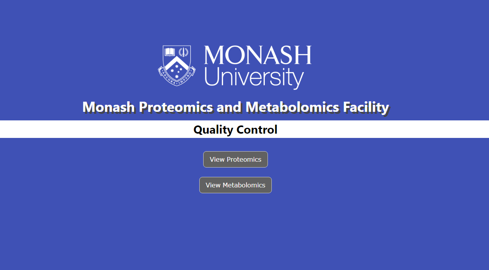
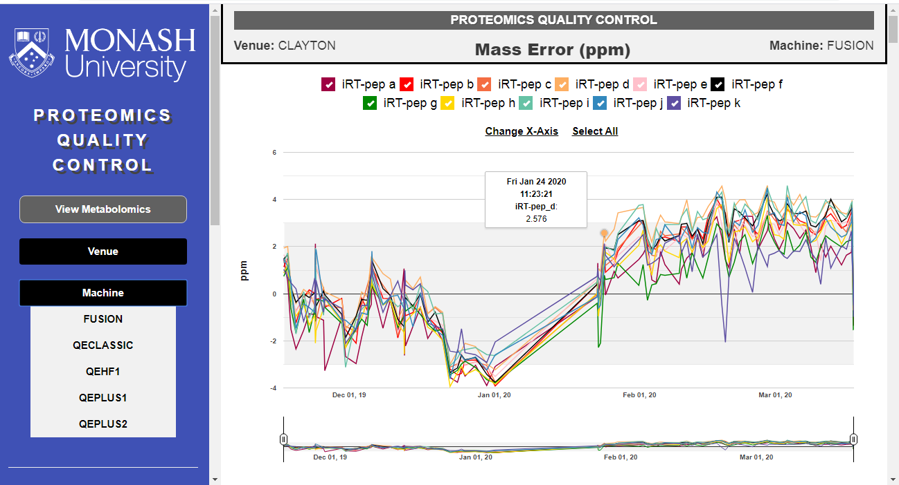
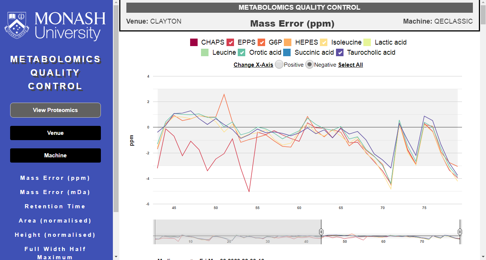

# MPMF Quality Control Server

This is the GitLab repository for the MPMF QC Server.  

### Install and Running
* Set-up the QC database   
https://gitlab.erc.monash.edu.au/scav6/Metabolomics-Quality-Control-Pipeline
* Clone this repository
* Run _npm install_ from the cloned directory.
* Set database details in models/connection.js
* Run _npm start_.
* Navigate to http://localhost:3000

### Demonstration Video
https://bit.ly/MPMFQC-Demo  

### Loading Page

### Proteomics Page

### Metabolomics Page

