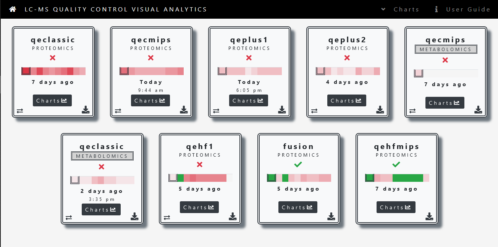
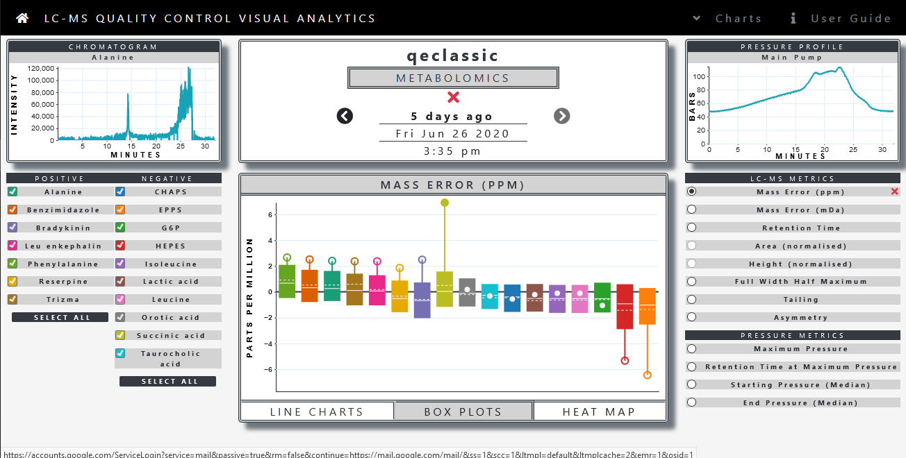

# MPMF Quality Control Server

This is the GitLab repository for the MPMF QC Server Version 2.0.  
This is an active development project. Stay tuned for updates.  

### Install and Running
* Set-up the QC database   
* Clone this repository
* Run _npm install_ from the cloned directory.
* Set database details in models/connection.js
* Run _npm start_.
* Navigate to http://localhost:3000 

### Summary Page

### Metabolomics Charts Page

